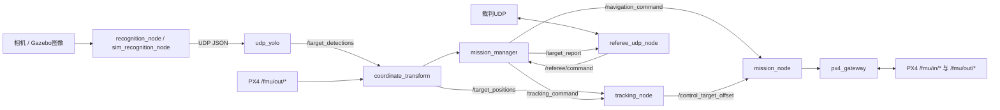

# 软件架构

## 数据流

## 模块职责

| 模块 | 职责 | 不应负责 |
| --- | --- | --- |
| `px4_gateway` | PX4消息、QoS、命令和设定点 | 比赛任务决策、视觉识别 |
| `mission_node` | 起飞、航点、搜索、跟踪切换、RTL | 图像处理、姿态内环 |
| `tracking_node` | 将目标状态转成受控相对偏移命令 | 直接发布PX4姿态/电机命令 |
| `coordinate_transform` | 像素、机体/本地坐标与经纬度换算、滤波 | 任务状态迁移 |
| `mission_manager` | 裁判命令到任务级动作、目标确认与上报 | PX4底层话题细节 |
| `referee_udp_node` | UDP套接字与协议编解码 | 飞行控制决策 |

## 坐标和接口风险

PX4局部位置通常使用NED，图像和ROS工具经常使用ENU或像素坐标。任何接口修改都应明确：

- frame名称；
-轴方向；
- 单位；
- 时间戳来源；
- 数据是否预测；
- 有效期和协方差/可信度。

当前多个跨包接口使用 `std_msgs/String` 承载JSON，便于比赛快速联调，但缺少编译期字段检查。后续建议把 `/navigation_command`、`/tracking_command`、`/control_target_offset` 和 `/target_positions` 迁移到 `infer_track_interfaces` 的强类型消息，并提供一次版本兼容期。

## 安全边界

飞控内环、姿态稳定、解锁检查、地理围栏、低电量和RTL仍由PX4负责。ROS节点只发送任务级命令和Offboard设定点。任何ROS异常都不应要求PX4关闭这些保护。
